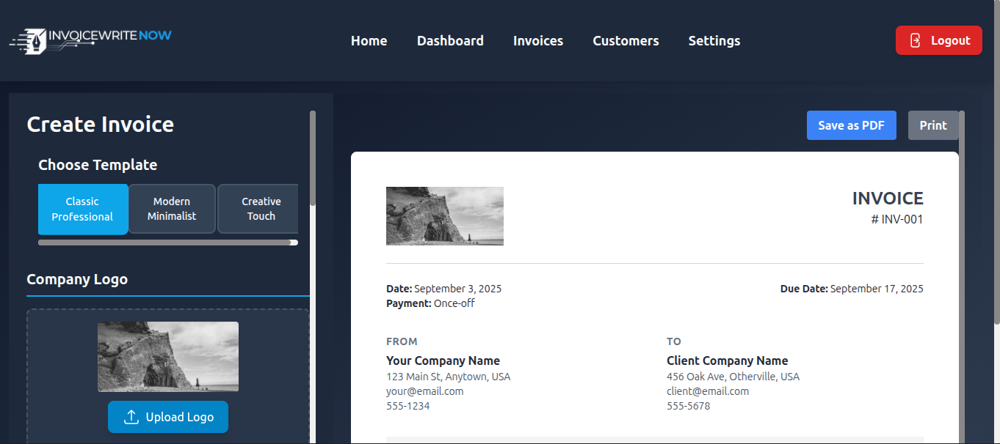

# InvoiceWrite Now - Modern Invoicing App

A comprehensive, modern invoicing application built with React, TypeScript, and Tailwind CSS. This application provides all the features needed for professional invoice management, customer relationship management, and business analytics.



## 🚀 Features

### 📊 Dashboard

- Real-time business analytics and KPIs
- Revenue tracking and payment status overview
- Recent invoices display
- Quick action buttons for common tasks
- Payment status summary with visual indicators

### 📄 Invoice Management

- **Create**: Intuitive invoice creation with live preview
- **Edit**: Full editing capabilities for existing invoices
- **View**: Professional invoice viewing with print support
- **Templates**: Multiple professional invoice templates
- **Status Tracking**: Draft, Sent, Viewed, Paid, Overdue status management
- **Print/PDF**: High-quality printing and PDF generation

### 👥 Customer Management

- Complete customer database with search and filtering
- Customer creation and editing forms
- Contact information and business details
- Customer statistics (total invoices, revenue, etc.)
- Customer-specific invoice history

### 📦 Product & Service Catalog

- Product/service management with categories
- Pricing and tax rate configuration
- Quick product selection during invoice creation
- Bulk product management capabilities

### ⚙️ Settings & Configuration

- **Company Details**: Business information and branding
- **Invoice Settings**: Number prefixes, tax rates, payment terms
- **Appearance**: Theme selection (Light/Dark modes)
- **Notifications**: Email alerts and payment confirmations
- **Currency Support**: Multiple currency options

### 💳 Payment Tracking

- Payment status management (Paid, Unpaid, Partial, Overdue)
- Due date tracking and overdue alerts
- Payment confirmation workflow
- Revenue analytics and reporting

## 🛠️ Technology Stack

- **Frontend**: React 19 with TypeScript
- **Routing**: React Router DOM v7
- **Styling**: Tailwind CSS v4 with custom design system
- **Icons**: Heroicons v2
- **Date Handling**: date-fns v4
- **State Management**: React Context API with useReducer
- **Build Tool**: Vite v6
- **Package Manager**: npm

## 📁 Project Structure

```
src/
├── components/          # Reusable UI components
│   ├── Navigation.tsx   # Main navigation header
│   ├── InvoiceForm.tsx  # Invoice creation/editing form
│   ├── InvoicePreview.tsx # Real-time invoice preview
│   └── ...
├── pages/              # Main application pages
│   ├── Dashboard.tsx   # Analytics dashboard
│   ├── Invoices.tsx    # Invoice list and management
│   ├── Customers.tsx   # Customer management
│   ├── Products.tsx    # Product catalog
│   ├── Settings.tsx    # Application settings
│   └── ...
├── contexts/           # React Context providers
│   └── AppContext.tsx  # Main application state
├── utils/              # Utility functions and helpers
│   └── mockData.ts     # Sample data generation
├── types.ts            # TypeScript type definitions
├── App.tsx             # Main application component
└── index.tsx           # Application entry point
```

## 🚦 Getting Started

### Prerequisites

- Node.js 18+ and npm 8+
- Modern web browser with ES2020+ support

### Installation

1. **Clone or download the project**

   ```bash
   cd modern-invoicing-app
   ```

2. **Install dependencies**

   ```bash
   npm install
   ```

3. **Setup environment variables**

   ```bash
   cp .env.example .env
   ```

   Then edit `.env` with your Firebase credentials:

   ```env
   # Firebase Configuration (get from Firebase Console)
   VITE_FIREBASE_API_KEY=your_api_key_here
   VITE_FIREBASE_AUTH_DOMAIN=your_project_id.firebaseapp.com
   VITE_FIREBASE_PROJECT_ID=your_project_id_here
   VITE_FIREBASE_STORAGE_BUCKET=your_project_id.firebasestorage.app
   VITE_FIREBASE_MESSAGING_SENDER_ID=your_sender_id_here
   VITE_FIREBASE_APP_ID=your_app_id_here
   VITE_FIREBASE_MEASUREMENT_ID=your_measurement_id_here
   
   # Admin Setup Key (change to your own secure key)
   VITE_ADMIN_SETUP_KEY=your_secure_setup_key_here
   ```

4. **Start development server**

   ```bash
   npm run dev
   ```

5. **Build for production**

   ```bash
   npm run build
   ```

6. **Preview production build**
   ```bash
   npm run preview
   ```

## 🎨 Design System

The application follows the "applook" design system with:

- **Color Palette**: Modern slate-based color scheme
- **Typography**: Clean, professional font hierarchy
- **Spacing**: Consistent 8px grid system
- **Components**: Reusable UI components with consistent styling
- **Responsive Design**: Mobile-first approach with breakpoints
- **Dark Theme**: Full dark mode support throughout the application

## 🔧 Configuration

### Environment Variables

The application uses environment variables for Firebase configuration and security:

- **Firebase credentials**: Required for authentication and database access
- **Admin setup key**: Secure key for creating the first admin account
- **All variables**: Must be prefixed with `VITE_` for Vite to include them in the build

⚠️ **Security Note**: Never commit your `.env` file to version control. It's already included in `.gitignore`.

### Settings Management

All application settings are managed through the Settings page:

- **Company Details**: Configure your business information
- **Invoice Preferences**: Set default templates, tax rates, and payment terms
- **Appearance**: Choose between light and dark themes
- **Notifications**: Configure email alerts and reminders

## 📱 Browser Support

- **Modern Browsers**: Chrome 90+, Firefox 88+, Safari 14+, Edge 90+
- **Mobile**: iOS Safari 14+, Chrome Mobile 90+
- **Print Support**: High-quality invoice printing across all browsers

## 🚀 Deployment

The application is built as a static SPA and can be deployed to any static hosting service:

1. **Build the application**

   ```bash
   npm run build
   ```

2. **Deploy the `dist` folder** to your hosting service of choice:
   - Vercel, Netlify, GitHub Pages
   - AWS S3 + CloudFront
   - Traditional web hosting

## 🔐 Security & Privacy

- **Firebase Authentication**: Secure user authentication and authorization
- **Firestore Security Rules**: Database access controlled by comprehensive security rules
- **Environment Variables**: Sensitive credentials stored securely in environment variables
- **Admin Approval System**: New users require admin approval before accessing the system
- **Role-Based Access**: Admins and users have different permission levels
- **Secure Setup**: One-time admin setup with secure key validation

## 🤝 Contributing

This is a complete, production-ready invoicing application. For customizations:

1. **Theme Customization**: Modify `tailwind.config.js` and CSS files
2. **Feature Extensions**: Add new components in the established patterns
3. **Data Integration**: Replace mock data with real backend integration
4. **Template Customization**: Modify invoice templates in preview components

## 📄 License

This project is provided as-is for educational and commercial use. Modify and distribute according to your needs.

## 🆘 Support

For questions or customization requests:

- Review the well-documented codebase
- Check component implementations for patterns
- Utilize TypeScript types for API guidance

## 🎯 Key Features Implemented

✅ **Complete Invoice Lifecycle Management**
✅ **Professional Dashboard with Analytics**
✅ **Customer Relationship Management**
✅ **Product/Service Catalog**
✅ **Comprehensive Settings System**
✅ **Modern, Responsive Design**
✅ **Print/PDF Generation**
✅ **Real-time Calculations**
✅ **Status Tracking & Workflows**
✅ **Search & Filtering**
✅ **Mobile-Friendly Interface**
✅ **Dark/Light Theme Support**

---

Built with ❤️ using modern web technologies for professional invoice management.

1. First-time Setup:

- Visit the app - you'll see an "Admin Setup" link on login/signup pages
- Click "Admin Setup" → /admin-setup
- Enter setup key: SETUP_ADMIN_2025
- Create your admin account
- Setup page becomes disabled automatically
